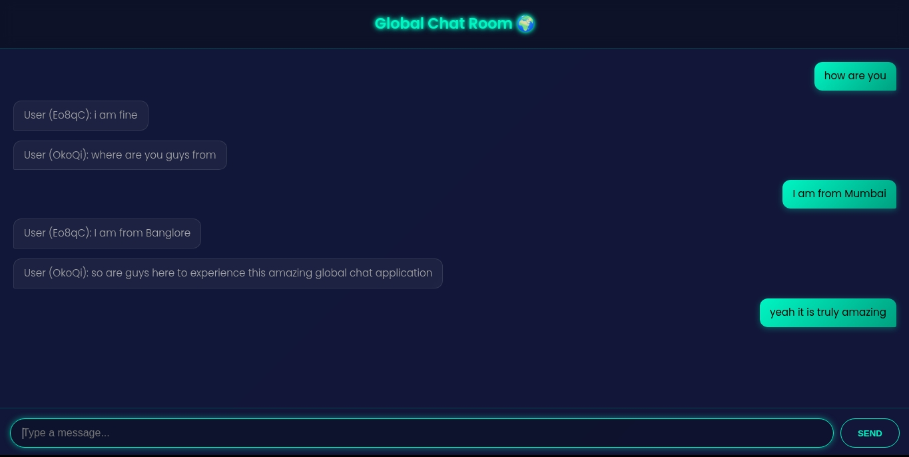

# 🚀 Futuristic Real-Time Global Chat Application

A sleek, modern, and real-time global chat application built with **Node.js**, **Express**, and **Socket.io**.  
It features a stunning futuristic UI with dynamic, persistent light and dark themes.

---

## ✨ Core Features
- **Instant Messaging**: Real-time, bidirectional communication powered by WebSockets (Socket.io).
- **Stunning UI/UX**: A beautiful *frosted glass* interface with glowing neon elements and smooth, subtle animations.
- **Dual Themes**: A user-selectable choice between a futuristic dark mode and a clean, elegant light mode. ☀️/🌙
- **Theme Persistence**: Saves theme preference in `localStorage` so your choice loads on your next visit.
- **Fully Responsive**: Mobile-first design that expands to full-screen layout on desktops.
- **Chat History**: New users are immediately caught up with conversation history upon connecting.
- **Simple & Anonymous**: No login required — just open the app and start chatting.

---

## 🛠️ Tech Stack
- **Backend**: Node.js, Express.js  
- **Real-Time Engine**: Socket.io  
- **Frontend**: HTML5, CSS3 (with CSS Variables for theming), Vanilla JavaScript  

---

## 📸 Screenshots

---
